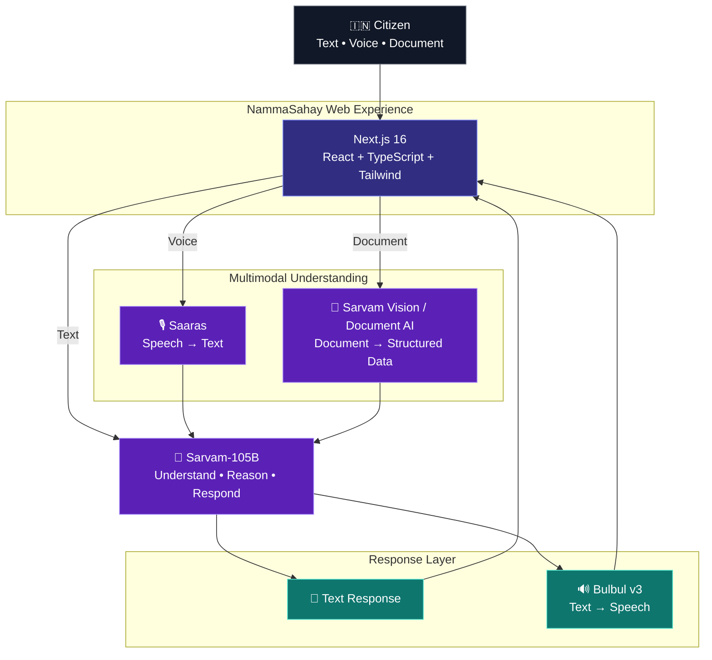
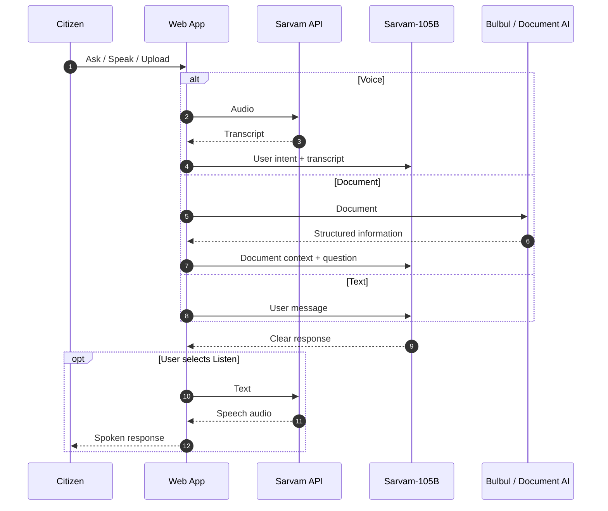

<div align="center">

<a href="https://github.com/24f2006688/nammasahay">
  
</a>

<p>
  <strong>A multilingual, voice-first AI companion for India's citizens.</strong><br/>
  Built with <strong>Sarvam AI</strong> for <strong>Sarvam Campus '26 × IIT Madras</strong>.
</p>

<p>
  <a href="https://nammasahay.vercel.app/"><strong>🚀 Live Demo</strong></a>
  &nbsp;·&nbsp;
  <a href="https://github.com/24f2006688/nammasahay"><strong>💻 Source Code</strong></a>
  &nbsp;·&nbsp;
  <a href="https://docs.sarvam.ai/"><strong>📚 Sarvam Docs</strong></a>
</p>

<br/>

[](https://www.sarvam.ai/)
[](https://nextjs.org/)
[](https://www.typescriptlang.org/)
[](https://tailwindcss.com/)

[](https://vercel.com/)
[](https://opensource.org/licenses/Apache-2.0)</div>

---

## ✨ Product in one sentence

> **NammaSahay lets people ask questions, speak naturally, listen to answers, and understand complex documents in the language they are comfortable with.**

The product combines **multilingual chat, speech recognition, speech synthesis, and document intelligence** behind one simple citizen-facing interface. It is designed around a simple interaction principle:

<div align="center">

### **The technology should adapt to the citizen — not the other way around.**

</div>

---

## 🪄 Experience the product

<div align="center">

| 💬 Ask | 🎙️ Speak | 🔊 Listen | 📄 Understand |
|:---:|:---:|:---:|:---:|
| Natural text & code-mixed questions | Voice-first input | Spoken responses | Document extraction + explanation |
| **Sarvam-105B** | **Saaras** | **Bulbul v3** | **Sarvam Vision / Document AI** |

</div>


```text
          ┌───────────────┐
          │    CITIZEN    │
          │ Text / Voice  │
          │ / Document    │
          └───────┬───────┘
                  │
          ┌───────▼────────┐
          │  UNDERSTAND    │
          │ Saaras / Vision│
          └───────┬────────┘
                  │
             ┌────▼────┐
             │  105B   │
             │  🧠🌐  │
             │  Reason │   
             └────┬────┘
                  │
          ┌───────▼────────┐
          │     RESPOND    │
          │ Text / Bulbul  │
          └───────┬────────┘
                  │
             ┌────▼────┐
             │ CITIZEN │
             │  Acts   │
             └─────────┘
```

<p align="center">
  
</p>

---

# 🧭 Why NammaSahay?

India is multilingual and naturally code-mixed, while many digital experiences still assume:

- typing is comfortable
- English is the preferred language
- service terminology is already familiar
- important information exists only as readable text
- users can interpret dense forms and official documents themselves

NammaSahay changes the interaction model.

### Instead of:

```text
Citizen → Keyboard → English → Complex portal → Search → Interpret
```

### NammaSahay aims for:

```text
Citizen
   │
   ├── speaks naturally
   ├── types naturally
   └── uploads a document
             │
             ▼
        AI understands
             │
             ▼
     Clear explanation
             │
             ▼
        Next action
```

The goal is not to replace official services. The goal is to make information **easier to understand and interact with**.

---

# 🚀 Core capabilities

## 01 — 💬 Ask

Ask questions naturally in supported Indian languages, English, or code-mixed language.

```text
"Aadhaar card-ai eppadi update panrathu?"
```

**Pipeline**

```text
User text
   ↓
Sarvam-105B
   ↓
Contextual reasoning
   ↓
Citizen-friendly answer
```

---

## 02 — 🎙️ Speak

Voice is a first-class input method.

```text
Human speech
     ↓
  Saaras STT
     ↓
  Transcript
     ↓
 Sarvam-105B
     ↓
   Answer
```

This allows the user to communicate without first converting their thoughts into formal written English.

---

## 03 — 🔊 Listen

Every useful answer can become spoken output.

```text
Sarvam-105B
     ↓
  Bulbul v3
     ↓
Natural speech
     ↓
   Citizen
```

The result is a conversational loop:

> **Speech → Understanding → Reasoning → Speech**

---

## 04 — 📄 Understand documents

Upload a PDF or image containing a letter, form, certificate, or other information-heavy document.

```text
PDF / Image
    ↓
Document AI / Sarvam Vision
    ↓
Structured information
    ↓
Sarvam-105B
    ↓
Simple explanation
    ↓
"What does this mean?"
"What should I do next?"
```

The product is designed to go beyond raw OCR. The useful output is the **meaning and actionable context**.

---

# 🏗️ System architecture



### Request lifecycle



---

# 🧠 Sarvam AI integration

| Component | Role in NammaSahay | Product flow |
|---|---|---|
| **Sarvam-105B** | Core language reasoning | Intent → context → response |
| **Saaras** | Speech recognition | Voice → text |
| **Bulbul v3** | Speech synthesis | Text → voice |
| **Sarvam Vision / Document AI** | Document intelligence | Document → structured information |

### Why this architecture?

Each model handles a distinct modality:

```text
          INPUT
            │
     ┌──────┼──────┐
     ▼      ▼      ▼
   TEXT   VOICE  DOCUMENT
     │      │      │
     │    Saaras  Vision
     │      │      │
     └──────┼──────┘
            ▼
       Sarvam-105B
            │
       ┌────┴────┐
       ▼         ▼
     TEXT      BULBUL
       │         │
       └────┬────┘
            ▼
          OUTPUT
```

Official references:

- [Sarvam models](https://docs.sarvam.ai/api/getting-started/models)
- [Sarvam-105B](https://docs.sarvam.ai/api/getting-started/models/sarvam-105b)
- [Bulbul](https://docs.sarvam.ai/api/getting-started/models/bulbul)
- [Document Intelligence](https://docs.sarvam.ai/api/api-guides-tutorials/document-intelligence/overview)

---

# 🇮🇳 Built around Indian communication

NammaSahay is designed for interaction patterns that are common in India:

- **Native scripts**
- **Romanized Indian languages**
- **Code-mixed language**
- **Voice-first interaction**
- **Regional-language explanations**
- **Documents containing Indian languages**

Example:

```text
Formal English:
"How can I update my Aadhaar address?"

Natural code-mixed interaction:
"Aadhaar address online-la eppadi change panrathu?"
```

The interface does not require the user to translate their thought process into formal English before asking for help.

---

# 🎬 Demo scenarios

## Scenario A — Everyday service question

```text
👤 Aadhaar card-ai eppadi update panrathu?

        ↓

🧠 Sarvam-105B

        ↓

💬 Clear Tamil / Tanglish explanation
```

---

## Scenario B — Voice-first interaction

```text
👤 "எனக்கு பாஸ்போர்ட் apply பண்ணணும்.
    என்ன documents வேண்டும்?"

        ↓

🎙️ Saaras

        ↓

🧠 Sarvam-105B

        ↓

🔊 Bulbul v3

        ↓

👤 Spoken answer
```

---

## Scenario C — Document understanding

```text
📄 Upload PDF / Image
        ↓
👁️ Document AI / Vision
        ↓
🧾 Structured information
        ↓
🧠 Sarvam-105B
        ↓
💡 Simple explanation
        ↓
➡️ Next-step guidance
```

---

# 🛡️ Engineering & security

The browser never receives the Sarvam API key.

```text
┌──────────────┐
│   Browser    │
│              │
│  No API Key  │
└──────┬───────┘
       │
       │ HTTPS request
       ▼
┌──────────────────────┐
│ Next.js API Route    │
│ /api/chat            │
│                      │
│ Server-side secret   │
└──────────┬───────────┘
           │
           │ SARVAM_API_KEY
           ▼
┌──────────────────────┐
│      Sarvam API      │
└──────────────────────┘
```

### Environment configuration

```env
SARVAM_API_KEY=your_sarvam_api_key
```

Never expose it as:

```env
NEXT_PUBLIC_SARVAM_API_KEY=...
```

And never commit `.env.local`.

---

# 🧰 Technology stack

<div align="center">

| Layer | Technology |
|---|---|
| **Frontend** | Next.js 16, React, TypeScript |
| **UI** | Tailwind CSS 4 |
| **AI reasoning** | Sarvam-105B |
| **Speech-to-text** | Saaras |
| **Text-to-speech** | Bulbul v3 |
| **Document intelligence** | Sarvam Vision / Document AI |
| **API layer** | Next.js Route Handler |
| **Source control** | Git + GitHub |
| **Deployment** | Vercel |

</div>

---

# 📁 Project structure

```text
nammasahay/
│
├── app/
│   ├── api/
│   │   └── chat/
│   │       └── route.ts        # Unified AI API workflows
│   │
│   ├── globals.css             # Global design system
│   ├── layout.tsx              # App shell + metadata
│   └── page.tsx                # Main citizen experience
│
├── lib/
│   └── sarvam/
│       └── client.ts           # Sarvam integration helpers
│
├── public/                     # Static assets
│
├── .env.local                  # Local secrets (never commit)
├── .gitignore
├── next.config.ts
├── package.json
├── package-lock.json
├── LICENSE        ←--- Apache 2.0
└── README.md
```

---

# ⚡ Quick start

## Prerequisites

- Node.js 20+
- npm
- Git
- Sarvam API key

## 1. Clone

```bash
git clone https://github.com/24f2006688/nammasahay.git
cd nammasahay
```

## 2. Install dependencies

```bash
npm install
```

## 3. Configure environment

Create `.env.local`:

```env
SARVAM_API_KEY=your_sarvam_api_key
```

## 4. Start development

```bash
npm run dev
```

Open:

```text
http://localhost:3000
```

---

# ☁️ Deploy to Vercel

1. Import the GitHub repository.
2. Select the Next.js project.
3. Add `SARVAM_API_KEY` to the project environment variables.
4. Deploy.
5. Open the production URL and test text, voice, and document workflows.

### Production

**Live Demo:** https://nammasahay.vercel.app/

---

# 📊 Product snapshot

| Dimension | NammaSahay |
|---|---|
| Primary users | Indian citizens |
| Interaction | Text + Voice + Documents |
| Language experience | Multilingual + code-mixed |
| AI reasoning | Sarvam-105B |
| Speech recognition | Saaras |
| Speech synthesis | Bulbul v3 |
| Document intelligence | Sarvam Vision / Document AI |
| Frontend | Next.js + TypeScript |
| Styling | Tailwind CSS |
| Deployment | Vercel |
| Repository | `24f2006688/nammasahay` |

---

# 🧪 Current capabilities

```text
1.  Multilingual chat
2.  Sarvam-105B reasoning
3.  Voice input
4.  Speech-to-text
5.  Text-to-speech
6.  Document upload
7.  Document extraction
8.  Document explanation
9.  Responsive web interface
```

---

# 🗺️ Roadmap

### Phase 01 — Current foundation

- [x] Multilingual chat
- [x] Voice input
- [x] Speech-to-text
- [x] Text-to-speech
- [x] Document upload
- [x] Document extraction
- [x] Document explanation
- [x] Responsive UI

### Phase 02 — Product depth

- [ ] Conversation history
- [ ] Automatic language detection
- [ ] Improved code-mixed handling
- [ ] Streaming voice interaction
- [ ] More document templates
- [ ] Verified official-source layer
- [ ] Accessibility improvements

### Phase 03 — Citizen workflows

- [ ] Government-service workflow navigation
- [ ] Personalized document checklist
- [ ] Application-status assistance
- [ ] RAG over verified government information
- [ ] WhatsApp integration
- [ ] Low-bandwidth mode
- [ ] PWA / mobile application

---

# 💡 Product principles

### 01 — Language is an interface

Users should be able to express intent in the language and form they naturally use.

### 02 — Voice is not an add-on

For many interactions, speaking can be more natural than typing. NammaSahay therefore treats speech as a primary input/output path.

### 03 — Documents should become understandable

The useful result is not only extracted text.

It is:

```text
What is this?
     ↓
What does it mean?
     ↓
What matters?
     ↓
What should I do next?
```

### 04 — AI complexity stays behind the interface

The citizen sees a simple experience:

```text
ASK → UNDERSTAND → ACT
```

while the application coordinates multiple AI capabilities behind the scenes.

---

# 🧱 Production-oriented design direction

NammaSahay's current architecture intentionally keeps the AI integration behind a server-side boundary.

This gives the project a clean path toward future additions such as:

```text
                    ┌────────────────────┐
                    │ Verified Sources   │
                    │ Government / APIs  │
                    └─────────┬──────────┘
                              │
                              ▼
Citizen → NammaSahay → Orchestration Layer
                              │
             ┌────────────────┼────────────────┐
             ▼                ▼                ▼
         Sarvam 105B       Document AI       Speech
             │                │                │
             └────────────────┼────────────────┘
                              ▼
                       Clear response
```

Future production work would focus on source verification, observability, authentication, rate limiting, privacy controls, evaluation, and stronger workflow validation.

---

# 🏆 Born at Sarvam Campus '26

**NammaSahay was built for Sarvam Campus '26 × IIT Madras**, around the theme:

> **Build with Sarvam AI**

The project demonstrates how multiple Sarvam capabilities can be composed into one user-facing application rather than presenting a single-model chatbot.

### The core product loop

```text
                 🇮🇳 CITIZEN
                     │
          ┌──────────┼──────────┐
          │          │          │
        TYPE       SPEAK      UPLOAD
          │          │          │
          │       SAARAS     VISION / DOC AI
          │          │          │
          └──────────┼──────────┘
                     ▼
               SARVAM-105B
                     │
              ┌──────┴──────┐
              ▼             ▼
            TEXT          BULBUL
              │             │
              └──────┬──────┘
                     ▼
                 UNDERSTAND
                     │
                     ▼
                    ACT
```

---

# 🌱 Vision

Technology becomes truly useful when people do not have to change themselves to use it.

<div align="center">

## **AI should meet people where they are — in their language, their voice, and their everyday context.**

</div>

---

# 🔗 Links

| Resource | Link |
|---|---|
| 🚀 **Live Demo** | https://nammasahay.vercel.app/ |
| 💻 **GitHub** | https://github.com/24f2006688/nammasahay |
| 🤖 **Sarvam AI** | https://www.sarvam.ai/ |
| 📚 **Sarvam API Docs** | https://docs.sarvam.ai/ |

---

<div align="center">

### 🇮🇳 NammaSahay

**Ask naturally. Speak naturally. Understand documents.**

<br/>


<br/><br/>

**Built with ❤️ using Sarvam AI**

</div>